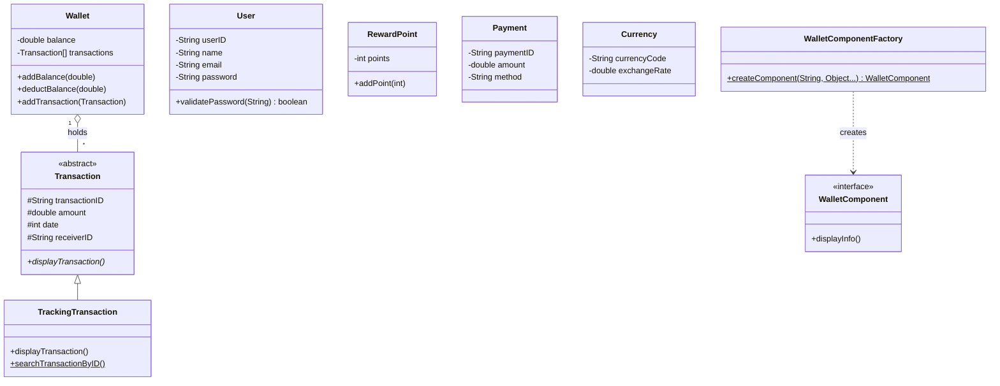

# Digital Wallet Application (Java)

A Java **Object-Oriented Programming** project that simulates a digital wallet system — register/login, top up a wallet, send money, make payments, track/search/delete transactions, earn reward points, and convert currencies — built with **Java Swing** for the GUI and **MySQL/JDBC** for persistence.

This project was built for **BCS2143 Object Oriented Programming** (Universiti Malaysia Pahang) and demonstrates the full range of OOP concepts covered in the course, from core language features (Phase II) through database-backed GUI and design patterns (Phase III).

> 📌 Every core OOP concept below is also marked directly in the source code with a `// OOP Requirement: ...` comment at the exact line where it's demonstrated, so the codebase itself doubles as a reference.

---

## ✨ Features

| Module | What it does |
|---|---|
| **Login / Register** | Create an account and log in; session is tracked so every screen knows who's logged in |
| **Wallet** | View your current balance the moment the screen opens, and top it up (amount is *added* to the existing balance, not overwritten) |
| **Transaction** | Send money to another user — validates the amount and date, checks your balance first, generates a sequential ID (`T001`, `T002`, …), and includes a built-in calendar date-picker (manual typing still works too) |
| **Payment** | Pay a bill with an auto-generated Payment ID (`P001`, `P002`, …) and an optional notes field, with balance validation |
| **Tracking Transaction** | Search any transaction by ID, view its full details, and optionally delete it |
| **Reward Point** | Earn and accumulate reward points, with your current balance shown as soon as the screen opens |
| **Currency Calculator** | Convert a USD amount into EUR, JPY, and INR using fixed exchange rates |

A parallel **console version** (`Main.java`) implements the same core logic (register, login, wallet, transactions, rewards, payments, currency conversion) purely with in-memory arrays and `Scanner` input — this is what satisfies the console-only Phase II requirements before the GUI/database layer was added.

---

## 🎓 OOP Concepts Demonstrated

| Concept | Where |
|---|---|
| Multiple classes | 25+ classes across `digitalwalletapplication` and `FactoryPattern` |
| Control & repetition statements | `Main.java` — `while` loop, `switch-case` |
| Arrays — object & primitive | `Main.java` — `User[]`, `Wallet[]`, … and `double[] transactionAmounts` |
| String class & methods | `.equals()`, `.trim()`, `.isEmpty()` used throughout |
| Encapsulation | Private fields + getters in every entity class (`User`, `Wallet`, `Payment`, `RewardPoint`, `Currency`, `Transaction`) |
| Composition & aggregation | `Wallet` holds an array of `Transaction` objects |
| Inheritance | `TrackingTransaction extends Transaction` |
| Polymorphism | `TrackingTransaction` overrides the abstract `displayTransaction()` method |
| Abstract class | `Transaction` (abstract method contract) |
| Interface | `WalletComponent` (FactoryPattern package) |
| Database manipulation (insert, edit, delete, search) | Register (insert), Wallet/Payment/Reward (update), Tracking Transaction (delete), Login/Tracking Transaction (search) |
| GUI input/output | Login, Register, Menu, and 6 feature screens built with Java Swing |
| Software design pattern (Factory) | `FactoryPattern` package — `WalletComponentFactory.createComponent()` returns a `WalletComponent` |

---

## 🏗️ Class Diagram (simplified)



---

## 🛠️ Tech Stack

- **Language:** Java (JDK, NetBeans project)
- **GUI:** Java Swing (NetBeans GUI Builder / GroupLayout)
- **Database:** MySQL (via XAMPP), accessed with JDBC (`MySQL Connector/J`, bundled in `lib/`)
- **Design Pattern:** Factory Pattern (`FactoryPattern` package)
- **IDE:** Apache NetBeans

---

## 📂 Project Structure

```
src/
├── digitalwalletapplication/   # Main system: console version + GUI + database
│   ├── Main.java               # Console entry point (Phase II — array/loop/OOP demo)
│   ├── Login.java / Register.java / Menu.java
│   ├── WalletGUI.java / PaymentForm.java / TransactionGUI.java
│   ├── TrackTransGUI.java / RewardGUI.java / CurrencyForm.java / DisplayCurrency.java
│   ├── User.java / Wallet.java / Transaction.java / TrackingTransaction.java
│   ├── Payment.java / RewardPoint.java / Currency.java
│   ├── Session.java            # Tracks the logged-in user across GUI screens
│   └── MyConnection.java       # JDBC connection helper
└── FactoryPattern/              # Standalone Factory Design Pattern demo
    ├── WalletComponent.java     # Interface
    ├── WalletComponentFactory.java
    └── UserFP.java / WalletFP.java / TransactionFP.java / RewardPointFP.java / CurrencyFP.java / PaymentFP.java
```

---

## 🗄️ Database Schema

```sql
CREATE TABLE `register` (
    `id` VARCHAR(50) PRIMARY KEY,
    `username` VARCHAR(50),
    `email` VARCHAR(100),
    `password` VARCHAR(100),
    `walletba` VARCHAR(50),      -- wallet balance
    `rewardpoints` INT DEFAULT 0
);

CREATE TABLE `transactions` (
    `transaction_id` VARCHAR(50) PRIMARY KEY,
    `user_id` VARCHAR(50) NOT NULL,
    `amount` DOUBLE NOT NULL,
    `transaction_date` VARCHAR(20),
    `recipient_id` VARCHAR(50),
    FOREIGN KEY (`user_id`) REFERENCES `register`(`id`)
);

CREATE TABLE `payments` (
    `payment_id` VARCHAR(50) PRIMARY KEY,
    `user_id` VARCHAR(50) NOT NULL,
    `amount` DOUBLE NOT NULL,
    `details` VARCHAR(255),
    `payment_date` TIMESTAMP DEFAULT CURRENT_TIMESTAMP,
    FOREIGN KEY (`user_id`) REFERENCES `register`(`id`)
);
```

---

## 🚀 Getting Started

1. **Start MySQL** (e.g. via XAMPP Control Panel).
2. **Create the database** `mydatabase` in phpMyAdmin and run the SQL above to create the three tables.
3. **Open the project in NetBeans** — the MySQL Connector/J driver is already bundled in `lib/` and wired into the project classpath, so no extra setup is needed.
4. **Clean and Build**, then run:
   - `digitalwalletapplication.Login` for the full GUI + database experience, or
   - `digitalwalletapplication.Main` for the console-only version, or
   - `FactoryPattern.Main` for the standalone Factory Pattern demo.

---


## 👥 Authors

**Group 8, Section 3B — BCS2143 Object Oriented Programming**
- Muhammad Ammar bin Azizan (CB23037)
- Muhammad Alif Aiman bin Azhar (CB23120)
- Muhammad Hizbu Farhan bin Alias (CB23022)

## 📄 License

MIT — see [LICENSE](LICENSE).
